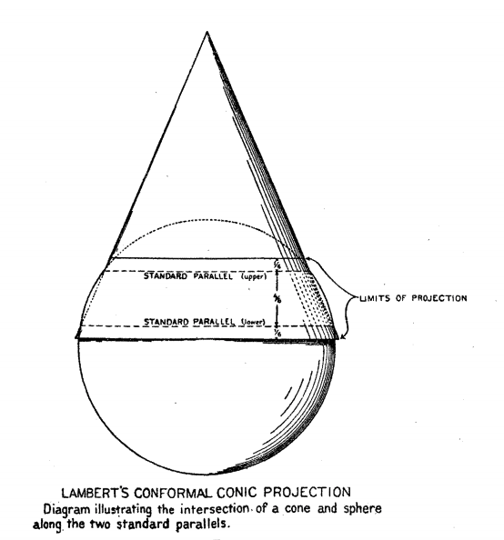

# gda20
Cartographic tools for working with MGA & VICGRID coordinate systems.

## MGA20

MGA (The Map Grid of Australia 2020) is a UTM projection based on the GDA20 datum with the following properties:
```
E0 = 500,000m false easting
N0 = 10,000,000m false northing
m0 = 0.9996 central scale factor
```

Zone 1 is defined to have central meridian 177°W and a zone width of 6°.

See the ICSM GDA2020 Technical Manual for reference
```
https://www.icsm.gov.au/sites/default/files/GDA2020TechnicalManualV1.1.1.pdf
```

## MGA94
MGA (The Map Grid of Australia 1994) is a UTM projection based on the GDA94. It has been superceded by MGA20.


## VICGRID94

VICGRID94 is a lambert conformal conic projection with two standard parrellels, centered on Victoria which uses the GDA94 [(Geocentric Datum of Australia 1994)](https://www.icsm.gov.au/datum/geocentric-datum-australia-1994-gda94) datum with the following properties:

```
E0 = 2,500,000m false easting
N0 = 2,500,000m false northing
φ1 = 36°S standard parralel 1
φ2 = 38°S standard parralel 2
(φ0, λ0) = (37°S, 145°E) true origin
```



See the VICGRID94 Map Projection Specifications doc for reference.

```
https://www.yumpu.com/en/document/view/11956152/vicgrid94-map-projection-introduction-specifications
```

## VICGRID

VICGRID is a lambert conformal conic projection similar to VICGRID94, but uses the AGD66 [(Australian Geodetic Datum 1966)](https://www.icsm.gov.au/datum/australian-geodetic-datum-196684-agd#:~:text=It%20was%20proclaimed%20in%20the,origin%20point%3A%20Johnston%20Geodetic%20Station.) datum. The VICGRID projection incorporates a different origin specification to VICGRID94 in order to avoid confusion between coordinates generated by the two projections. It has been superceeded by VICGRID94.

```
E0 = 2,500,000m false easting
N0 = 4,500,000m false northing
φ1 = 36°S standard parralel 1
φ2 = 38°S standard parralel 2
(φ0, λ0) = (37°S, 145°E) true origin
```

See the VICGRID94 Map Projection Specifications doc for reference

```
https://www.yumpu.com/en/document/view/11956152/vicgrid94-map-projection-introduction-specifications
```

## Installation
```
poetry install
```