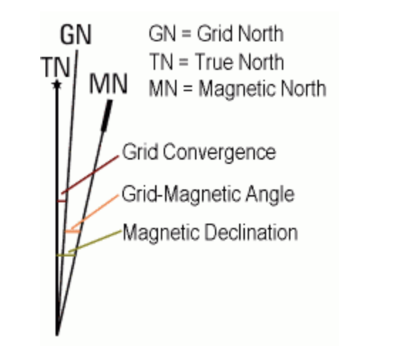

# gda20
Cartographic tools for working with the MGA (Map Grid of Australia) & GDA20 (Geographic Datum of Australia).
* function for calculating grid convergence within zones 54 & 55 (to be generalized)
* function for computing magnetic declination and grid magnetic angle using World Magnetic Model of 2020. 




## Installation
```
poetry install
```

### Note:
declination package has been ripped from https://github.com/cmweiss/geomag, but has been modified to use the World Magnetic Model for 2020. 
A PR has been submitted with this change to the repo which was declined.
All height calculations have been stripped so the calculation is valid at the surface only


## Reference: 
```
http://www.ga.gov.au/scientific-topics/positioning-navigation/geodesy/datums-projections/gda2020
https://www.ga.gov.au/scientific-topics/positioning-navigation/australian-geospatial-reference-system
https://www.ga.gov.au/scientific-topics/positioning-navigation/geodesy/transform-convert
```